# Attendance & Overtime System: Detailed Rules, Flowcharts and a Full Scenario

Companion to `docs/SYSTEM_BLUEPRINT.md`. That file is the overview. This one explains **each rule step by step**, with a flowchart, pseudo-code and worked timestamps, and ends with **one complete scenario from import to report**.

- Every number in the scenario was produced by running the system's own pairing code (`AttendanceProcessor::processPersonPunches`) and a copy of the OT engine loop (`ComputationService`) on the scenario data. It is not hand arithmetic.
- The flowcharts use Mermaid syntax. They render on GitHub and in most Markdown viewers, and an AI can read them as structured text.
- File references look like `path:line`.

## Contents
1. Master workflow (import → review → report)
2. Stage 1: Reading the biometric file
3. Stage 2: Choosing the pairing rule (Day / Night / Reliever)
4. Rule A: Day-shift pairing
5. Rule B: Night-shift pairing
6. Rule C: Reliever pairing
7. Stage 3: Saving attendance records (filters)
8. Stage 4: Seeded OT at import (Formula A)
9. Stage 5: The OT engine (Formula B/C): schedule, late rule, hourly walk, ORD vs RD
10. Stage 6: Review actions and what each one recalculates
11. Stage 7: Payroll report
12. FULL SCENARIO: 3 employees, 1 week, import to report
13. Summary of rule pitfalls shown by the scenario

---

## 1. Master workflow

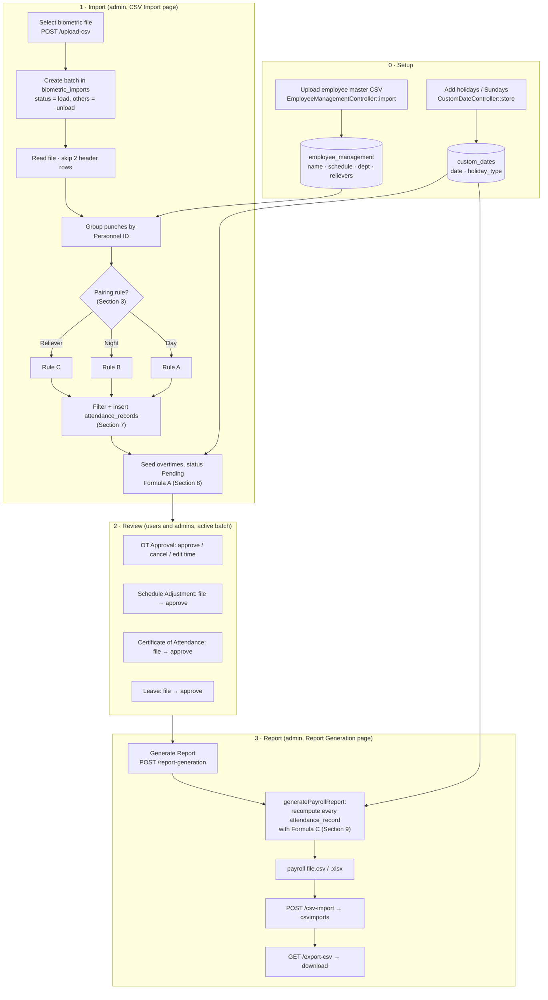

### HTTP sequence (who calls what)

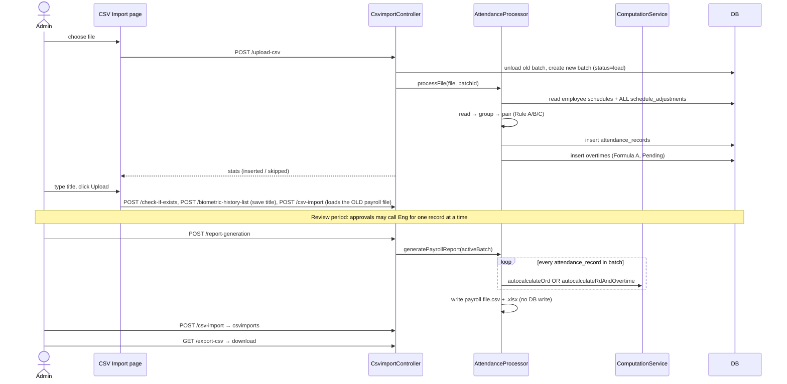

---

## 2. Stage 1: Reading the biometric file

`AttendanceProcessor::readAttendanceFile` (`app/Services/AttendanceProcessor.php:103`)

| Step | Rule |
|---|---|
| File types | `.xlsx` / `.xls` (via PhpSpreadsheet) or `.csv` |
| Header | **Skip the first 2 rows** (row 1 = "Transactions" title, row 2 = column headers) |
| Columns used | A Personnel ID · B First Name · C Last Name · E Attendance Area · F Serial No · G Attendance Point · **H Attendance time** · I Verification · J Photo · K Data Source |
| Time parsing | Tries `n/j/Y g:i` (e.g. `8/18/2025 7:52`), then any date format. Rows that can't be parsed are **dropped silently**. |
| Output | A flat list of punches, one per row. There is no in/out flag: every punch is just a timestamp. |

Then `groupByPersonnelId` (`:200`) groups the punches by Personnel ID and sorts each group by time.

Employee name = `"<Last Name>, <First Name>"` from the **first punch** of that person. It must match `employee_management.employee_name` **exactly** (case and spaces). If it doesn't, the person is dropped at insert time (`skipped_no_emp`).

---

## 3. Stage 2: Choosing the pairing rule

`processPersonPunches` (`:219`) decides **once per employee per import**. Every punch of that employee in the file then uses the same rule.

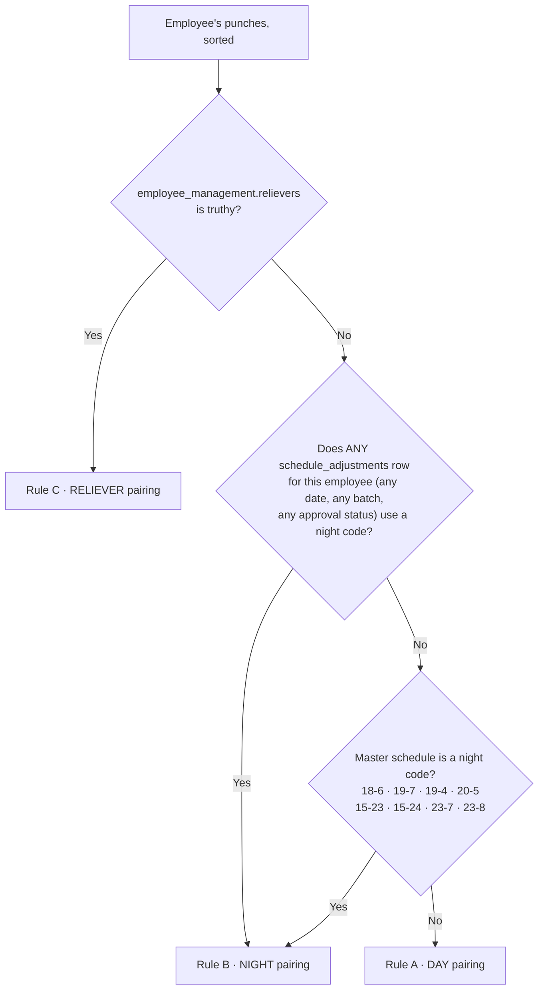

Things to know:
- **Night codes:** `18-6, 19-7, 19-4, 20-5, 15-23, 15-24, 23-7, 23-8`. Anything else (e.g. `8-17`, `7-19`) counts as a day schedule.
- **One historical night adjustment switches the employee to night pairing permanently.** The lookup reads the whole `schedule_adjustments` table: old batches, Pending and Cancelled rows included. See Scenario §12.9.
- **The schedule itself is not used for pairing beyond this choice.** SG Vesta auto-detection (7-19 vs 19-7) only happens later, in the OT engine.

---

## 4. Rule A: Day-shift pairing

**Who:** non-relievers with no night code in the master schedule and no night schedule adjustment.

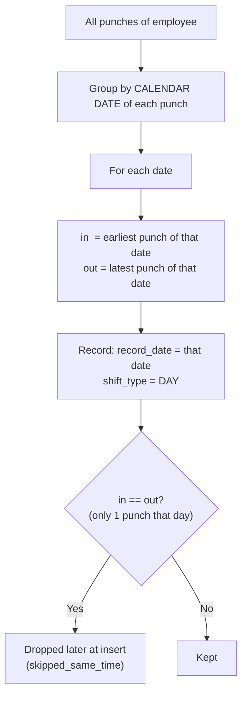

**Pseudo-code**
```
for each date D in punches:
    in  = min(punches on D)
    out = max(punches on D)
    emit {record_date: D, earliest: in, latest: out, type: DAY}
```

**Behaviour**
| Situation | Result |
|---|---|
| 07:52, 12:01, 12:58, 17:05 (lunch punches) | 07:52 → 17:05. Middle punches are ignored. |
| Forgot to punch out (only 08:03) | 08:03 → 08:03, **dropped**. Needs a Certificate of Attendance. |
| Shift crosses midnight (19:00 Mon, 07:00 Tue) | Mon 19:00 → 19:00 and Tue 07:00 → 07:00. **Both dropped.** A night worker must not be on Rule A. |
| Night worker on day rule with 2 punches per date (Tue 06:58 end of Mon shift, Tue 18:50 start of Tue shift) | Tue 06:58 → 18:50: a **fake 11h52m day** made from two different shifts. |

---

## 5. Rule B: Night-shift pairing

**Who:** non-relievers whose master schedule is a night code, **or** who have any night-code schedule adjustment on file.

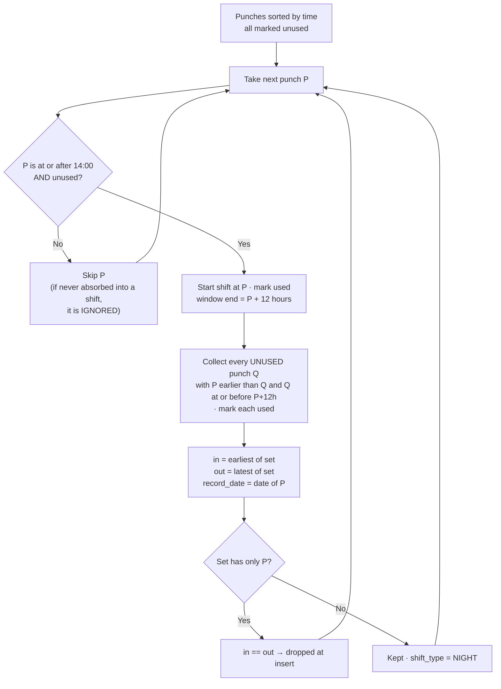

**Pseudo-code**
```
used = all false
for each punch P in time order:
    if P.hour >= 14 and not used[P]:
        used[P] = true
        set = [P] + every unused Q where P < Q <= P + 12h   (mark them used)
        emit {record_date: date(P), earliest: min(set), latest: max(set), type: NIGHT}
# punches before 14:00 that no shift absorbed are ignored
```

**Behaviour**
| Situation | Result |
|---|---|
| 19:02 Mon → 06:58 Tue (11h56m) | Paired. record_date = Mon. |
| 19:10 Wed, 23:30 Wed (break), 07:00 Thu | 19:10 → 07:00. The break punch is absorbed. |
| 19:00 Thu → 07:00 Fri (exactly 12h) | Paired (the window end is inclusive). |
| **18:50 Tue → 07:05 Wed (12h15m)** | 07:05 is outside the 12h window, so the set is {18:50} and the record is 18:50 → 18:50 and **dropped**. 07:05 is before 14:00 and is **ignored**. **The whole shift is lost.** |
| Morning punch at 06:59 on the first day of the file (end of a shift from the previous period) | Before 14:00 and not absorbed, so **ignored** |
| A shift that starts before 14:00 (e.g. a 6-15 day shift for someone on night pairing) | Its in punch can't start a set. Its 15:00 out punch starts one and grabs the next morning's punch, which **pairs the wrong punches together**. |

> **Maximum span = 12h.** On a 12h schedule like `19-7`, arriving even one minute early and leaving on time (or later) makes the span over 12h, and the day disappears. Night-shift OT beyond the schedule end can never be imported from punches.

---

## 6. Rule C: Reliever pairing

**Who:** employees with `employee_management.relievers` truthy. This rule is checked first and overrides both A and B.

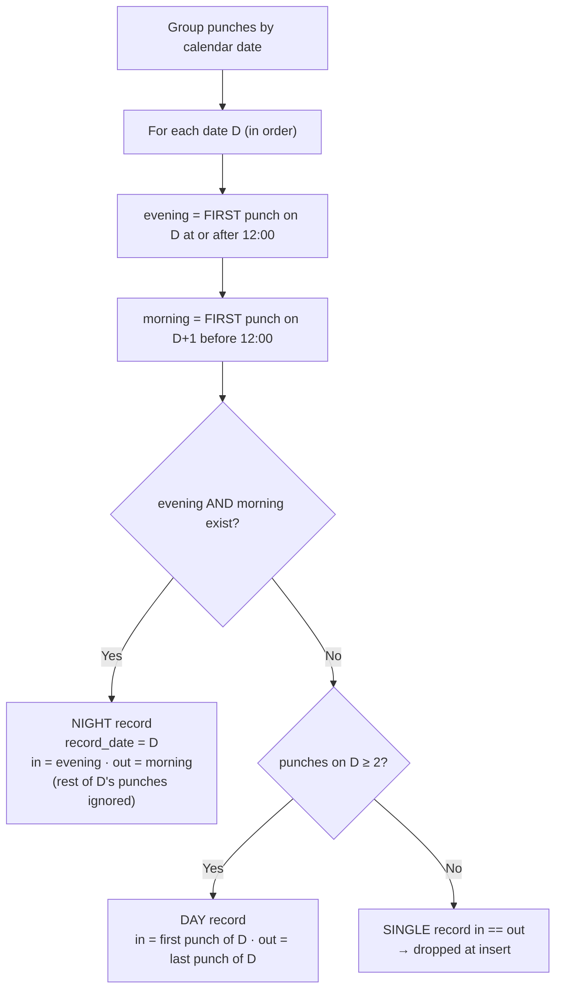

**Pseudo-code**
```
for each date D:
    evening = first punch on D with hour >= 12
    morning = first punch on D+1 with hour < 12     # NOT marked as used
    if evening and morning: emit NIGHT {D, evening → morning}
    elif count(D) >= 2:     emit DAY   {D, first(D) → last(D)}
    else:                   emit SINGLE {D, p → p}  # dropped later
```

**Behaviour**
| Situation | Result |
|---|---|
| Night: 19:00 Wed → 07:00 Thu | NIGHT Wed 19:00 → 07:00 ✔ |
| **Day shifts on consecutive days:** Mon 07:55–17:02, Tue 07:58–17:10 | Mon: evening = 17:02, Tue morning = 07:58, so **NIGHT Mon 17:02 → Tue 07:58** (a fake 14h56m shift). Tue is also paired as a DAY 07:58 → 17:10, so **07:58 is used twice**. |
| Day shift on the last day with punches (no next-day morning) | DAY ✔ |
| Day shift with a lunch punch at 12:05 and work the next day | evening = 12:05 (the first punch ≥ 12:00), so NIGHT 12:05 → next morning ✘ |
| The morning after a night shift (07:00 alone) | SINGLE, dropped (correct: it was already used as the out punch) |

> Rule C is only correct when the reliever works **nights**, or **a day shift not followed by a morning punch the next day**.

---

## 7. Stage 3: Saving attendance records

`insertAttendanceRecords` (`:370`). Every paired record goes through these filters:

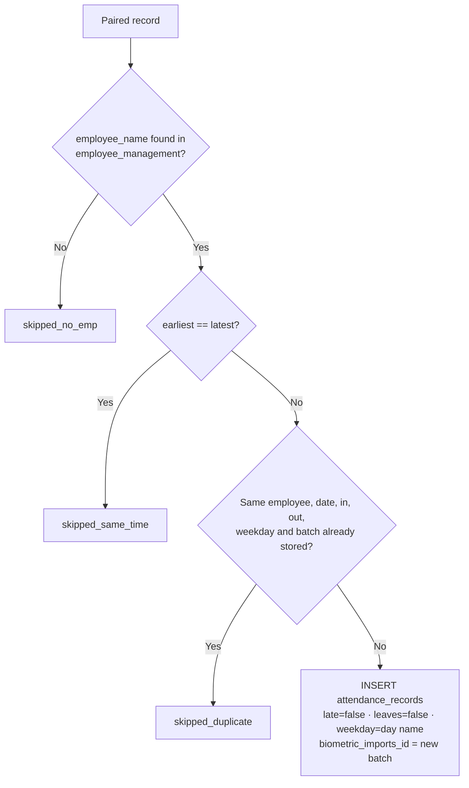

The stats `{inserted, skipped_duplicate, skipped_same_time, skipped_no_emp}` are returned to the import page.

---

## 8. Stage 4: Seeded OT at import (Formula A)

`calculateHoursForBiometricImport` (`:461`) runs right after the insert, for every record in the new batch. It fills the **OT Approval** page.

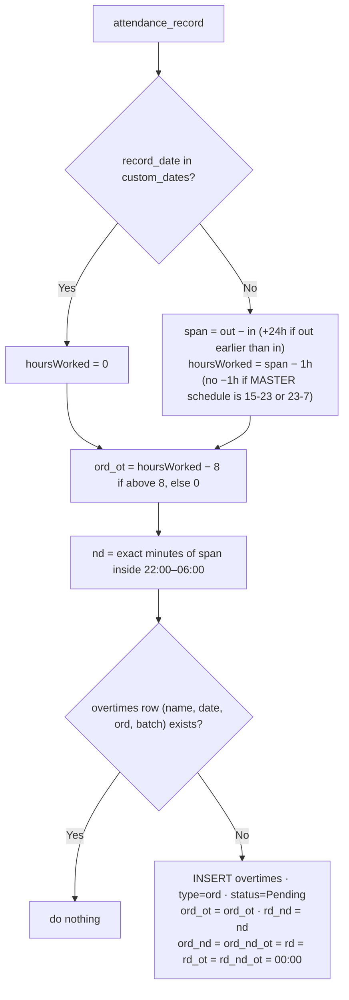

**How it differs from the real engine (Section 9):**

| Formula A (seed) | Engine (report) |
|---|---|
| No late rule | Late rule (in → start + 1h) |
| Uses the master schedule only | Uses a schedule adjustment first |
| No SG Vesta detection | SG Vesta detection |
| ND stored in `rd_nd`, even on workdays | ND split into `ord_nd` / `ord_nd_ot` |
| Holiday work = 0 everywhere except `rd_nd` | Holiday work → RD/SH/LH buckets |
| ND = exact minutes | ND = whole blocks classified by their start time |

---

## 9. Stage 5: The OT engine (Formula B/C)

`app/Services/ComputationService.php`. It is used by every approval that recalculates (Section 10) and by the payroll report (Section 11).

### 9.1 Full engine flowchart

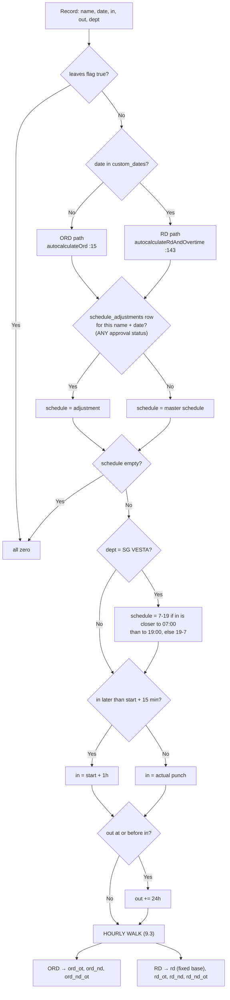

### 9.2 Late rule, exactly
```
start       = first number of the schedule   ("8-17" → 08:00, "19-7" → 19:00)
lateCutoff  = start + 00:15
if in > lateCutoff:  in = start + 01:00      # replaces the punch, whatever time it was
```
| Schedule | Punch in | Engine in | Effect |
|---|---|---|---|
| 8-17 | 07:52 | 07:52 | Early arrival counts |
| 8-17 | 08:15 | 08:15 | Within grace |
| 8-17 | 08:25 | **09:00** | Loses 35 min |
| 8-17 | 10:00 | **09:00** | **Gains** 1h the person wasn't there |
| 8-17 | 17:02 (reliever night) | **09:00** | Shift now starts 8h before the real punch (§12) |
| 19-7 | 19:10 | 19:10 | Within grace |

### 9.3 Hourly walk
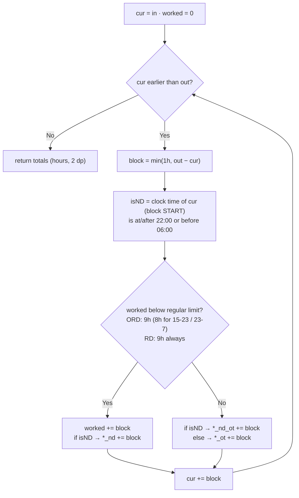
- **The first 9 hours are "regular"** (8 paid + 1 break). OT starts at hour 9.
- **ND is decided by where each block starts.** A block from 21:55 to 22:55 counts as *non-ND* even though 55 of its minutes are ND.

### 9.4 RD base hours
`rd` is a fixed value based on the schedule, not the hours worked:
| Schedule | rd |
|---|---|
| 7-16, 8-17, 7-19, 6-15, 9-15, 10-18, 10-16 | 8 |
| 15-24 (in hour ≥ 15) | 6 |
| 23-8 (in hour ≥ 23) | 2 |
| 23-7 (in hour ≥ 23) | 1 |
| anything else (**18-6, 19-7, 19-4, 20-5, 15-23**) | **0** |

### 9.5 Saving to `overtimes`: `logOvertimeDb` (`:282`)
- Hours are converted to `HH:MM` as `round(hours × 60)` minutes.
- The row is matched on (name, date, `type`, batch, attendance_record_id).
- **Existing `ord` row:** only `ord_ot`, `ord_nd`, `ord_nd_ot`, `schedule` and `schedule_shift` are updated. Any seeded `rd_nd` stays.
- **No row:** a new row is inserted with every field.

---

## 10. Stage 6: Review actions and what each recalculates

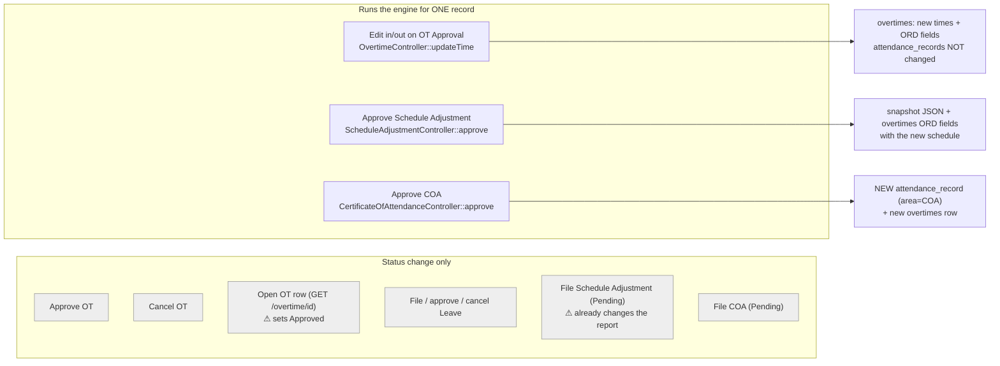

Which actions change the **payroll report**?

| Action | Changes the report? | Why |
|---|---|---|
| Approve COA | **Yes** | It adds an attendance record |
| File or approve a schedule adjustment | **Yes, already when filed** | The engine reads adjustments without checking their status |
| Add a holiday | **Yes** | It changes ORD/RD and the bucket |
| Edit time on OT Approval | **No** | Only `overtimes` changes, and the report reads `attendance_records` |
| Approve or cancel OT | **No** | The report never reads `overtimes` |
| Approve a leave | **No** | Nothing sets `attendance_records.leaves` |

---

## 11. Stage 7: Payroll report

`generatePayrollReport` (`:714`)

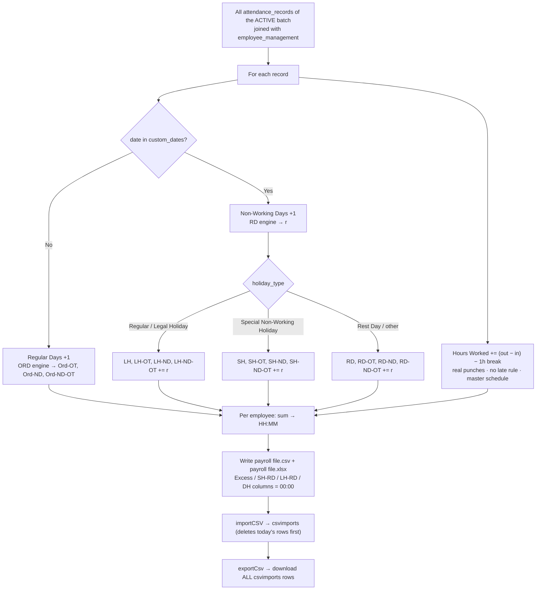

---

## 12. FULL SCENARIO: import to report

### 12.1 Setup data

**employee_management**
| unique_id | employee_name | schedule | department | relievers | basic |
|---|---|---|---|---|---|
| TMNG-000001 | DELA CRUZ, JUAN | 8-17 | ADMIN | false | 18000 |
| TMNG-000002 | SANTOS, MARIA | 19-7 | OPERATIONS | false | 16000 |
| TMNG-000003 | REYES, PEDRO | 8-17 | OPERATIONS | **true** | 15000 |

**custom_dates** (period Mon 2025-08-18 to Sun 2025-08-24)
| record_date | title | holiday_type |
|---|---|---|
| 2025-08-21 (Thu) | Ninoy Aquino Day | Special Non-Working Holiday |
| 2025-08-24 (Sun) | Sunday Rest Day | Rest Day |

**schedule_adjustments:** none at import time.

### 12.2 Biometric file (column H values, after the 2 header rows)

| Personnel | Punches |
|---|---|
| JUAN | 08/18 07:52, 12:01, 12:58, 17:05 · 08/19 08:25, 17:30 · 08/20 07:58, 20:10 · 08/21 08:00, 17:00 · 08/22 08:03 *(forgot to punch out)* |
| MARIA | 08/18 06:59 *(end of the previous period's shift)*, 19:02 · 08/19 06:58, 18:50 · 08/20 07:05, 19:10, 23:30 · 08/21 07:00, 19:00 · 08/22 07:00 · 08/23 19:05 · 08/24 07:00 |
| PEDRO | 08/18 07:55, 17:02 · 08/19 07:58, 17:10 · 08/20 19:00 · 08/21 07:00 · 08/22 08:00, 17:00 |

### 12.3 Step 1: Rule selection
| Employee | relievers? | night adjustment? | master night code? | **Rule** |
|---|---|---|---|---|
| JUAN | no | no | 8-17 → no | **A · Day** |
| MARIA | no | no | 19-7 → yes | **B · Night** |
| PEDRO | yes | – | – | **C · Reliever** |

### 12.4 Step 2: Pairing trace (real output of `processPersonPunches`)

**JUAN, Rule A**
| Date | Punches that day | in → out | Result |
|---|---|---|---|
| Mon 18 | 07:52, 12:01, 12:58, 17:05 | 07:52 → 17:05 | kept |
| Tue 19 | 08:25, 17:30 | 08:25 → 17:30 | kept |
| Wed 20 | 07:58, 20:10 | 07:58 → 20:10 | kept |
| Thu 21 | 08:00, 17:00 | 08:00 → 17:00 | kept |
| Fri 22 | 08:03 | 08:03 → 08:03 | **dropped (same time)** |

**MARIA, Rule B**
| Start punch (≥14:00) | Window end (+12h) | Punches absorbed | in → out | Result |
|---|---|---|---|---|
| *(Mon 06:59 is before 14:00 and nothing absorbs it)* | – | – | – | **ignored** |
| Mon 19:02 | Tue 07:02 | Tue 06:58 | Mon 19:02 → 06:58 | kept |
| Tue 18:50 | Wed 06:50 | *(none: Wed 07:05 is 15 min too late)* | Tue 18:50 → 18:50 | **dropped: shift lost** |
| *(Wed 07:05 is before 14:00 and not absorbed)* | – | – | – | **ignored** |
| Wed 19:10 | Thu 07:10 | Wed 23:30, Thu 07:00 | Wed 19:10 → 07:00 | kept |
| Thu 19:00 | Fri 07:00 | Fri 07:00 (inclusive) | Thu 19:00 → 07:00 | kept |
| Sat 19:05 | Sun 07:05 | Sun 07:00 | Sat 19:05 → 07:00 | kept (dated **Saturday**) |

**PEDRO, Rule C**
| Date D | evening (first ≥12:00 on D) | morning (first before 12:00 on D+1) | Record | Result |
|---|---|---|---|---|
| Mon 18 | 17:02 | Tue 07:58 | **NIGHT Mon 17:02 → 07:58** | kept, but **wrong** (he worked two day shifts) |
| Tue 19 | 17:10 | *(Wed has no morning punch)* | DAY Tue 07:58 → 17:10 | kept (07:58 used twice) |
| Wed 20 | 19:00 | Thu 07:00 | NIGHT Wed 19:00 → 07:00 | kept ✔ |
| Thu 21 | *(none)* | – | SINGLE 07:00 → 07:00 | dropped |
| Fri 22 | 17:00 | *(no Sat punches)* | DAY Fri 08:00 → 17:00 | kept ✔ |

**Import result:** 12 attendance_records inserted. Juan 4, Maria 4, Pedro 4. Skipped for same time: 3 (Juan Fri, Maria Tue, Pedro Thu).

### 12.5 Step 3: Seeded `overtimes` (Formula A), all Pending
| Employee · Date | in → out | hoursWorked | ord_ot | rd_nd *(ND stored here)* |
|---|---|---|---|---|
| Juan Mon | 07:52 → 17:05 | 8.22 | 00:13 | 00:00 |
| Juan Tue | 08:25 → 17:30 | 8.08 | **00:05** *(the engine will say 0: late)* | 00:00 |
| Juan Wed | 07:58 → 20:10 | 11.20 | 03:12 | 00:00 |
| Juan Thu (SH) | 08:00 → 17:00 | 0 (holiday) | 00:00 | 00:00 |
| Maria Mon | 19:02 → 06:58 | 10.93 | 02:56 | 08:00 |
| Maria Wed | 19:10 → 07:00 | 10.83 | 02:50 | 08:00 |
| Maria Thu (SH) | 19:00 → 07:00 | 0 (holiday) | 00:00 | 08:00 |
| Maria Sat | 19:05 → 07:00 | 10.92 | 02:55 | 08:00 |
| Pedro Mon | 17:02 → 07:58 | 13.93 | 05:56 | 08:00 |
| Pedro Tue | 07:58 → 17:10 | 8.20 | 00:12 | 00:00 |
| Pedro Wed | 19:00 → 07:00 | 11.00 | 03:00 | 08:00 |
| Pedro Fri | 08:00 → 17:00 | 8.00 | 00:00 | 00:00 |

This is what supervisors see on the **OT Approval** page.

### 12.6 Step 4: Review actions during the period
| # | Who / page | Action | System effect |
|---|---|---|---|
| R1 | Juan · COA | File COA for Fri 22, 08:00–17:00 → Admin approves | New attendance_record (area `COA`). Engine: 9h span, OT 0. New overtimes row with 00:00. |
| R2 | Maria · COA | File COA for Tue 19, 18:50–07:05 (the lost shift) → approved | New attendance_record. Engine: ord_ot 0.25, ord_nd 5, ord_nd_ot 3. |
| R3 | Pedro · Schedule Adjustment | File Wed 20 → `19-7` → approved | Snapshot saved. Engine rerun for Wed with 19-7: ord_ot 1, ord_nd 6, ord_nd_ot 2, written to the ORD fields (the seeded rd_nd 08:00 stays). |
| R4 | Supervisor · OT Approval | Approve Juan Wed 03:12. Cancel Juan Tue 00:05. | Status only. **No effect on the report.** |
| R5 | Pedro · Leave | Leave Sat 23 approved | Status only. **No effect.** |

**Why R3 matters.** Without the adjustment, Pedro's Wed night is computed with his master schedule `8-17`. In 19:00 is later than 08:15, so the late rule moves in to **09:00 Wed**. The walk then runs from 09:00 to 07:00 Thu: ord_ot 5.00 and ord_nd_ot 8.00, a phantom 13h of OT. With `19-7`, in stays 19:00 and the result is correct.

There is **no UI action that fixes Pedro's Monday**. The fake 17:02 → 07:58 record goes through the late rule with 8-17 (in → 09:00) and produces ord_ot 5.97 and ord_nd_ot 8.00. Only fixing the data (or the pairing code) removes it.

### 12.7 Step 5: Report engine trace (every record of the active batch)

**JUAN** (schedule 8-17, regular limit 9h)
| Date | Path | in (after late rule) → out | Walk | Result |
|---|---|---|---|---|
| Mon 18 | ORD | 07:52 → 17:05 | 9 regular blocks end 16:52 · 16:52–17:05 OT | ord_ot **0.22** |
| Tue 19 | ORD | 08:25 is late → **09:00** → 17:30 | 8.5h, under 9h | 0 |
| Wed 20 | ORD | 07:58 → 20:10 | regular until 16:58 · OT 16:58–20:10 | ord_ot **3.20** |
| Thu 21 | RD → **SH** | 08:00 → 17:00 | 9h regular | rd **8** (day shift base), rd_ot 0 |
| Fri 22 (COA) | ORD | 08:00 → 17:00 | 9h regular | 0 |

Hours Worked = (553 + 545 + 732 + 540 + 540 min) − 5 × 60 = 2610 min = **43.50**

**MARIA** (schedule 19-7, regular limit 9h)
| Date | Path | in → out (+24h) | Regular blocks start at… | ND inside regular | OT blocks | Result |
|---|---|---|---|---|---|---|
| Mon 18 | ORD | 19:02 → 06:58 | 19:02 … 03:02 | 22:02–03:02 = 6 | 04:02 ND, 05:02 ND, 06:02–06:58 | ord_nd 6 · nd_ot 2 · ot **0.93** |
| Tue 19 (COA) | ORD | 18:50 → 07:05 | 18:50 … 02:50 | 22:50–02:50 = 5 | 03:50, 04:50, 05:50 ND · 06:50–07:05 | ord_nd 5 · nd_ot 3 · ot **0.25** |
| Wed 20 | ORD | 19:10 → 07:00 | 19:10 … 03:10 | 6 | 04:10, 05:10 ND · 06:10–07:00 | 6 · 2 · **0.83** |
| Thu 21 | RD → **SH** | 19:00 → 07:00 | 19:00 … 03:00 | 6 | 04:00, 05:00 ND · 06:00–07:00 | rd **0** (19-7 has no base) · rd_nd 6 · rd_nd_ot 2 · rd_ot 1 |
| Sat 23 | ORD (Sunday hours count as Saturday) | 19:05 → 07:00 | 19:05 … 03:05 | 6 | 04:05, 05:05 ND · 06:05–07:00 | 6 · 2 · **0.92** |

Hours Worked = (716 + 735 + 710 + 720 + 715) − 5 × 60 = 3296 min = **54.93**

Mon span = 716 min (19:02 → 06:58).

**PEDRO** (master 8-17, adjustment Wed = 19-7)
| Date | Path | Schedule used | in → out | Result |
|---|---|---|---|---|
| Mon 18 (fake night) | ORD | 8-17 | 17:02 is late → **09:00 Mon** → 07:58 Tue | ord_ot **5.97** · ord_nd 0 · ord_nd_ot **8.00** |
| Tue 19 | ORD | 8-17 | 07:58 → 17:10 | ord_ot **0.20** |
| Wed 20 | ORD | **19-7** (adjustment) | 19:00 → 07:00 | ord_ot **1.00** · ord_nd **6** · ord_nd_ot **2** |
| Fri 22 | ORD | 8-17 | 08:00 → 17:00 | 0 |

Hours Worked = (896 + 552 + 720 + 540) − 4 × 60 = 2468 min = **41.13**. The adjustment doesn't change Hours Worked.

### 12.8 Step 6: Final payroll rows (`payroll file.csv`, non-zero columns)

| Column | JUAN | MARIA | PEDRO |
|---|---|---|---|
| ID | TMNG-000001 | TMNG-000002 | TMNG-000003 |
| Basic | 18000 | 16000 | 15000 |
| Hours Worked | 43.5 | 54.93 | 41.13 |
| Total Regular Working Days Present | 4 | 4 | 4 |
| Total Non-Working Days Present | 1 | 1 | 0 |
| Ord-OT | **03:25** (0.22 + 3.20) | **02:56** (0.93 + 0.25 + 0.83 + 0.92) | **07:10** (5.97 + 0.20 + 1.00) |
| Ord-ND | 00:00 | **23:00** | **06:00** |
| Ord-ND-OT | 00:00 | **09:00** | **10:00** (8 fake + 2) |
| RD / RD-OT / RD-ND / RD-ND-OT | 00:00 | 00:00 | 00:00 |
| SH | **08:00** | 00:00 | 00:00 |
| SH-OT | 00:00 | **01:00** | 00:00 |
| SH-ND | 00:00 | **06:00** | 00:00 |
| SH-ND-OT | 00:00 | **02:00** | 00:00 |
| LH-*, SH-RD-*, LH-RD-*, DH-*, all *Excess | 00:00 | 00:00 | 00:00 |

Then:
- `importCSV` deletes today's `csvimports` rows and inserts these 3.
- `exportCsv` downloads **every** `csvimports` row, including earlier periods.

### 12.9 What-if: one old night adjustment for Juan

Suppose `schedule_adjustments` holds **any** `19-7` row for Juan, even a cancelled one from last year. On the next import he is switched to **Rule B** (real output):

| Start (≥14:00) | Absorbed within 12h | Record | Result |
|---|---|---|---|
| Mon 17:05 | – | 17:05 → 17:05 | dropped |
| Tue 17:30 | – | 17:30 → 17:30 | dropped |
| Wed 20:10 | Thu 08:00 | **Wed 20:10 → Thu 08:00** | kept (fake night) |
| Thu 17:00 | – | 17:00 → 17:00 | dropped |

Juan's four real day shifts become **one fake overnight record**.

---

## 13. Pitfalls this scenario demonstrates

| # | Rule | Pitfall | Seen in |
|---|---|---|---|
| 1 | B · Night | Shifts longer than 12h lose their out punch, and the whole day is dropped | Maria Tue |
| 2 | B · Night | Punches before 14:00 that no shift absorbs are ignored | Maria Mon 06:59, Wed 07:05 |
| 3 | Rule choice | Any night adjustment ever filed switches the employee to night pairing for every day | §12.9 |
| 4 | C · Reliever | Day shifts on consecutive days are paired as a fake night (evening → next morning), and the morning punch is reused | Pedro Mon |
| 5 | Engine · late rule | A night record evaluated with a day schedule is moved to start + 1h on the same day, creating huge phantom OT | Pedro Mon, Pedro Wed without R3 |
| 6 | Engine · late rule | Very late arrivals are credited back to start + 1h | §9.2 (10:00 → 09:00) |
| 7 | Engine · RD base | Night schedules get rd = 0 on holidays and rest days | Maria Thu |
| 8 | Engine · dates | A shift is dated by its start, so Saturday-night work that runs into Sunday is paid as ORD | Maria Sat |
| 9 | Seed vs engine | The OT Approval page shows values the report won't use (late rule, ND in `rd_nd`) | Juan Tue 00:05 vs 0 |
| 10 | Report | OT approve/cancel and leaves don't affect the payroll | R4, R5 |
| 11 | Engine · ND | ND is decided by each block's start time (can be off by up to 59 min per shift) | Section 9.3 |
| 12 | Report | Excess, SH-RD, LH-RD and DH columns are always 00:00 | 12.8 |

---

### Prompt tip if you feed this to an AI
> "Using `docs/SYSTEM_BLUEPRINT.md` and `docs/SYSTEM_BLUEPRINT_DETAILED.md`, produce [a presentation / training manual / test cases / redesign proposal]. Treat Section 12 as ground truth for expected outputs, and Section 13 as known defects."
